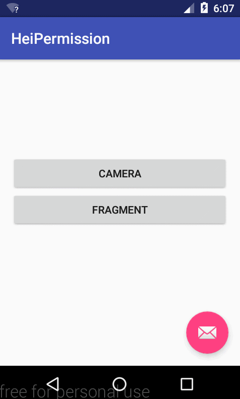

# HeiPermission

Android M 动态权限解决方案，Let You Fly！

[**Demo_APK下载**](img/app-debug.apk)

## 动图（相信你会Star的）

## 使用方式

1.	导入permlib到Project中，app添加库依赖。（建议拷贝源码，可根据需求定制）
2.	下面列出简单的使用方法

Activity中：

	首先需要检测权限的 Activity extends PermissionActivity

	checkPermission(new CheckPermListener() {
                    @Override
                    public void superPermission() {
                       TODO : 需要权限去完成的功能
                    }
                },R.string.camera, Manifest.permission.CAMERA);

Fragment中：
   
	 首先Fragment依存的 Activity extends PermissionActivit

	((PermissionActivity)getActivity()).checkPermission(
		new PermissionActivity.CheckPermListener() {
            @Override
            public void superPermission() {
                 TODO : 需要权限去完成的功能
            }
        },R.string.camera, Manifest.permission.CAMERA);

## 感谢开源库

***[EasyPermissions](https://github.com/googlesamples/easypermissions)***

## 联系作者
邮箱:forjrking@sina.com
#License

    Copyright 2016 forJrking
    
    Licensed under the Apache License, Version 2.0 (the "License");
    you may not use this file except in compliance with the License.
    You may obtain a copy of the License at
    
        http://www.apache.org/licenses/LICENSE-2.0
    
    Unless required by applicable law or agreed to in writing, software
    distributed under the License is distributed on an "AS IS" BASIS,
    WITHOUT WARRANTIES OR CONDITIONS OF ANY KIND, either express or implied.
    See the License for the specific language governing permissions and
    limitations under the License.
